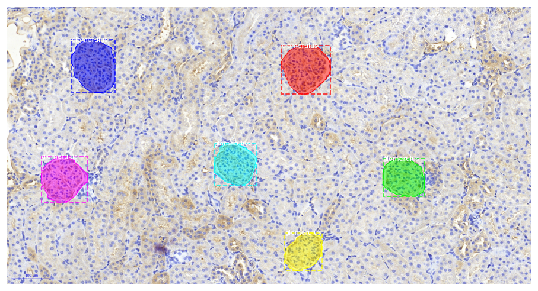

# Glomeruli Segmentation in Histology images

This repository is an Artificial Intelligence project aiming to segment [kidney glomeruli](https://en.wikipedia.org/wiki/Glomerulus_(kidney)) in histology images. It makes use of the [Mask R-CNN implementation by Matterport](https://github.com/matterport/Mask_RCNN).

Performance as of 19th of June 2020 : Mask IoU ~ 0.879  
(Mask IoU is defined as Intersection over Union between the generated masks and ground truth masks. A 0.88 Mask IoU basically means that the generated mask is 88% accurate)

# Table of Contents
<!-- TOC depthFrom:2 depthTo:6 withLinks:1 updateOnSave:1 orderedList:0 -->

- [Business Problem](#business-problem)
- [Data specifications](#data-specifications)
- [Available Data](#available-data)
- [Project Definition](#project-definition)
- [Performance Metrics](#performance-metrics)
- [Results Log](#results-log)

<!-- /TOC -->

## Business Problem

Des chercheurs en biologie étudient les effets d'une pathologie sur les [glomérules](https://fr.wikipedia.org/wiki/Glom%C3%A9rule_r%C3%A9nal) du rein. Pour mesurer ces effets, ils étudient des coupes histologiques de reins sur lesquels la pathologie est révélée par un marquage de couleur qui ressort généralement en marron foncé sur un fond marron clair. Pour quantifier le niveau de pathologie du rein, les chercheurs doivent estimer le pourcentage de la surface des glomérules qui est marquée en marron foncé.

A l'aide d'un logiciel de gestion d'images (Distribution [Fiji](http://fiji.sc/) du logiciel open source [Imaji](https://en.wikipedia.org/wiki/ImageJ)), les chercheurs :
* délimitent manuellement les contours des glomérules (précisément la membrane basale de la capsule de Bowman),
* font un seuillage pour ne garder que la surface marquée en marron foncé,
* mesurent à l'aide du logiciel la surface marquée et la surface totale du glomérule pour en déduire le pourcentage marqué.

L'opération la plus fastidieuse et chronophage est celle qui consiste à délimiter manuellement les glomérules. L'objectif du projet est d'entraîner une intelligence artificielle à segmenter automatiquement les glomérules dans une image histologique de rein.

## Data specifications

Les coupes histologiques sont livrées aux chercheurs sous la forme d'un fichier numérique de très haute résolution, dans un format propriétaire qui ne peut être visualisé qu'avec un logiciel spécifique. Pour des raisons de taille et de format, il n'est pas possible de procéder aux mesures directement sur cette image. En revanche, il est possible de zoomer sur des zones de l'image et les exporter au format jpg.
Par ailleurs, les chercheurs ne s'intéressent qu'à certaines zones de l'image, là où la coupe est nette et montre une section significative des glomérules.

Pour toutes ces raisons, les chercheurs commencent par extraire de l'image haute résolution des zooms sur des zones d'intérêts.

Exemple (cf. dossier Data/sample) :
* les fichiers R22 VEGF 2_15.0xC1.jpg à R22 VEGF 2_15.0xC5.jpg sont des images extraites d'une même coupe histologique du rein n° R22
* VEGF est un des types de marqueurs utilisés. D'autres coupes sont effectuées avec des reins marqués par PAS ou HES.
* 15 est le grossissement du zoom par rapport à l'image haute définition d'origine. Les chercheurs peuvent utiliser des grossissement entre 5 et 30.
* le fichier a typiquement une résolution de 1920x1018 pixels et pèse environ 2,5 Mo. Il peut cependant y avoir des résolutions légèrement différentes.

Dans ImageJ, les chercheurs ouvrent chaque image zoom, et délimitent les cellules à l'aide d'une souris ou d'une tablette graphique. Chaque délimitation est enregistrée par Fiji sous la forme d'un fichier .roi (acronyme de "Region of interest"). Il y a donc généralement plusieurs fichiers ROI pour chaque image zoom, et ils sont tous compressés dans un .zip
* Par exemple : RoiSetR22C1.zip contient sept ROI correspondant à des cellules dans l'image R22 VEGF 2_15.0xC1.jpg
* Chaque ROI contient (entre autres) les coordonnées (x,y) de chaque pixel du contour délimité par le chercheur.

Une fois les ROI générés, le logiciel est capable de calculer la surface du glomérule et la surface marquée à l'intérieur du glomérule.

## Available Data

Pour des raisons de confidentialité et de taille de stockage, le repository github ne présente qu'un échantillon de données (dossier Data/sample). L'ensemble des données est accessible aux contributeurs du projet sur un [drive google partagé](https://drive.google.com/open?id=1rmJG8g-bZpiiZyb6SJd3uqtqJOa-EQ9X).

##### Volumétrie:
  * taille : 1290 Mo
  * volumétrie : 574 images avec les fichiers .roi associés
  * résolution 1920x1018  en général, quelquefois 1831x1058
  * trois colorations : VEGF, PAS, IgG
  * grossissement : x15 en majorité, x20 sur les PAS

##### Répartition par type de marqueurs :

  | marker|	en % de patients|	en % d'images|	en % de glomerulus|
  |-|-|-|-|
  |	VEGF|37.9%	|36.6%	|41.4%|
  |	PAS	|36.8%	|40.8%	|33.2%|
  |	IgG	|25.3%	|22.6%	|25.3%|

## Project Definition

L'objectif de ce projet d'intelligence artificielle est :
* de prendre en entrée une image zoom de taille de de grossissement quelconque
* de produire en sortie
  * un fichier zip de ROI contenant les délimitations de chaque cellule dans l'image
  * une image avec les délimitations superposées

## Performance Metrics

Performance for instance segmentation models are usually measured with [Mean Average Precision](https://medium.com/@yanfengliux/the-confusing-metrics-of-ap-and-map-for-object-detection-3113ba0386ef). However this metrics is very technical and does not reflect the business perspective.

User interviews about their expectations revealed that :
* They expect the program to detect all glomeruli
* They can accept approx. 10% error on the contour (as they themselves don't draw perfect contours)
* They don't mind false postive too much (it's easy to discard them)

As a consequence, the performance metrics are defined as :
* % of undetected glomeruli
* % of false positive
* Mean IoU between generated masks and ground truth mask for True Positive

## Results Log

### V2.2 - June 19th 2020
* Major change : RPN_ANCHOR_SCALES = (64, 128, 256, 512,1024)  
(anchor scale twice to better manage small and large glomerulus)

|                | Train        | Valid       | Test V2.1  |
|----------------|--------------|-------------|------------|
|#images         | 461          | 58          | 55         |
|#glomeruli      | 2936         | 359         | 348        |
|#undetected     | 23 (0.79%)   | 3 (0.84%)   |**2 (0.57%)** |
|#false positive | 362 (12.36%)  | 30 (8.36%)  | 43 (12.36%) |
|**#mean IoU on TP** |0.880    | 0.875      |**0.881**  |
|#mean AP        |0.7348        | 0.7303      | 0.7445     |

Comments:
* much better level of detection (>99% accuracy)
* high number of false positive (but not a problem)
* mIOU is improved and very similar on each set

### V2.1 - June 13th 2020
* MASK_SHAPE scaled up to (56,56) [makes masks more precise]

|                | Train        | Valid       | Test V2.1  |
|----------------|--------------|-------------|------------|
|#images         | 461          | 58          | 55         |
|#glomeruli      | 2936         | 359         | 348        |
|#undetected     | 54 (1.84%)   | 4 (1.11%)   |**8 (2.3%)** |
|#false positive | 356 (12.13%)  | 29 (8.08%)  | 43 (12.36%) |
|**#mean IoU on TP** |0.863    | 0.858      |**0.867**  |
|#mean AP        |0.736        | 0.730      | 0.745     |

Comments:
* slight improvement on IoU and detection
* high number of false positive

#### V2.0 - June 6th 2020
* Confinement is over, the full dataset is accessible=> 3 times more images, with VGEF, IgG and PAS markers
* Dataset split into 80% train, 10% val, 10% test.
* Split done by patient to avoid data leakage
* Still a lot of undetected

|                | Train        | Valid       | Test V2.0  |
|----------------|--------------|-------------|------------|
|#images         | 461          | 58          | 55         |
|#glomeruli      | 2936         | 359         | 348        |
|#undetected     | 74 (2.52%)   | 6 (1.67%)   |**1 (0.29%)**  |
|#false positive | 243 (8.28%)  | 19 (5.29%)  | 25 (7.18%) |
|**#mean IoU on TP** |0.856    | 0.851      |**0.861**  |
|#mean AP        |0.727        | 0.720      | 0.756     |

NB : "Test V1" = performance of the previous model measured on the new test set

Comments:
* High #undetected in Train set : mostly due to PAS X20. The problem seems to be the low contrast between the glomerulus and the backgournd + the zoom difference (x20 instead of the more common x15). One IgG image is corrupted (rois not aligned with the image)
* Validation : all undetected come from PAS x20
* Test : the only undetected comes form a VGEF - small and blurry glomerulus
* this model is generally imprecise on masks
* mean IoU is not fully reproducible and may oscillate +/- 10% (seemingly due to Gpu randomness)

To do for next version:
* correct or delete the corrupted IgG image
* include contrast enhancement in data preparation
* increase the mask size parameter

#### V1 - April 9th 2020
* Still Confined => same dataset
* Major change in the model : added augmenters scale and contrast

|                | Train       | Valid       | Test |
|----------------|-------------|-------------|---------|
|#images         | 161         | 39          | 15      |
|#glomeruli      | 1161        | 277         | 106     |
|#undetected     |2 (0.17%)    | 2 (0.72%)   | 11 (10.38%)  |
|#false positive |118 (10.16%) | 19 (6.86%)  | 6 (5.66%)   |
|**#mean IoU on TP** |**0.8761**       |**0.8852**     |**0.7256**     |
|#mean AP        |0.7639       | 0.7571      | 0.5909     |

Note : on Test, one image is responsible for 6 undetected

#### V0 - March 23rd 2020
* Confined, limited access to data
* Training dataset is composed of 200 VEGF x15 images.
* Test dataset is composed of 15 IgG and CD68 x15 images -  
 **warning** : labelled by the programmer => not fully accurate
* Model trained for 40 epoch (20 head + 20 full)

|                | Train       | Valid       | Test |
|----------------|-------------|-------------|---------|
|#images         | 161         | 39          | 15 |
|#glomeruli      | 1161        | 277         | 106 |
|#undetected     |1 (0.09%)    | 1 (0.36%)   | 8 (7.55%) |
|#false positive |162 (13.95%) | 35 (12.64%) | 10 (9.43%) |
|**#mean IoU on TP** |**0.6906**       | **0.8349**      | **0.6847** |
|#mean AP        |0.7194       | 0.7070      | 0.5782 |
