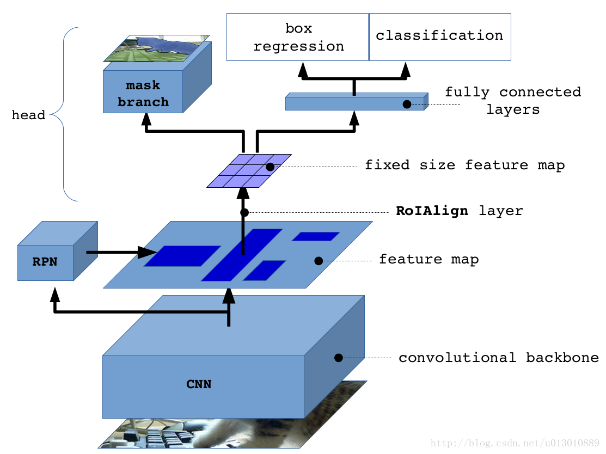

## Segmentation with Mask RCNN

A l'issue d'une phase de recherche documentaire, nous avons choisi d'implémenter le modèle Mask R-CNN.

Les articles de recherche de référence sur ce modèle sont regroupés dans le dossier "Reference Research Papers". Les autres articles étudiés, écartés, mais intéressants, sont dans le dossier 'Other Research'.

Ce document donne des éléments de compréhension générale moins formels.

### Good lectures about segmentation techniques

* Detection and Segmentation techniques - Stanford Lecture : [video](https://www.youtube.com/watch?v=nDPWywWRIRo) and [Slides](http://cs231n.stanford.edu/slides/2017/cs231n_2017_lecture11.pdf)
* FCN for Segmentation : https://youtu.be/-lXfsWP7DJ8?t=518

### Notes about detection and segmentation techniques

#### Image Classification and localization :
* Question : There is one object in an image. Which type is it and where is it (give me a bounding box) ?
* Answer : **CNN (convolutional Neural Network)** + FC (Fully connected) layers.
  * Add a softmax for class predictions
  * Add a regression for the 4 parameters (x,y,h,w) of the bounding box.

#### Semantic segmentation :
* Question : To which class belongs each of the pixel in the image ?
* Naive answer : slide a window on the image, feed it to an Image classification Network, and tag the center pixel with this class : very slow !
* Good answer : **FCN (Fully Convolutional Networks)** for Semantic Segmentation
  * Idea 1 : turn the FC layers of the image classification into 1x1 CNN layers => FCN (Fully convolutional network). What do you gain ? Whatever the size of the image, the network can process it. The output will be proportional to the size and all convolutions are done at once, which is much quicker than sliding window.
  * Idea 2 : the result is a reduced image. So you need to **upsample**, in order to recover the orignal size. One way to do this is by reverting the maxpooling of the CNN. Actually it's easier, and more accurate to learn them. That's what is called **transposed convolution layers**, a kind of fractional Max Pooling, that upscales the image.
  * Idea 3 : **Feature Pyramid Network** , which enables multiple scale upsample. Indeed, the upsampling might be too coarse if the CNN is very deep (because the CNN would output a X32 subsampling for instance). To make it finer, we sum upsampling of outputs of the CNN at different stage of the network, like (((C5 upscale 2+ C4) upscale 2 + C3) upscale 2 + C2) upscale 4, instead of C5*32. See Reference Resarch Paper about FCN and this [video](https://youtu.be/-3ylPH3BCWY?t=282) up to 9:00.

#### Mutliple object detection :
* Question : same Image Classification and Localization, but there can be several objects => the model should output as many class+box as there are objects
* naiwe answer : slide a window, and try for different scales. TOO SLOW
* Good answer : **Region Proposal**.
  * RCNN (2014) : Generate 1000 region of interest with some algorithm. Shrink them to the same size. Send them in a CNN detection and localization (adjustement to the ROI) system
  * Fast RCNN (2015) : First send the image in an FCN, then generate the ROI, warp them to the same size "ROI Pooling", send then in a FC layer and output classes and localization
  * Faster RCNN (2015) : Learn the ROI and the rest, all at once. Precisely you train RPN with a class for object / no object detection + regression over correction to add to RPN to get a good bounding box coordinates + object classes
  * Yolo is another declinaison of the Region Proposal idea, which is quicker but less accurate.

#### Instance Segmentation :
* Question : Multiple object detection AND segmentation ?
* Answer : **Mask R-CNN** (2017-2018). It is a Faster RCNN + a semantic segmentation on each RPN. It combines all of the above.

